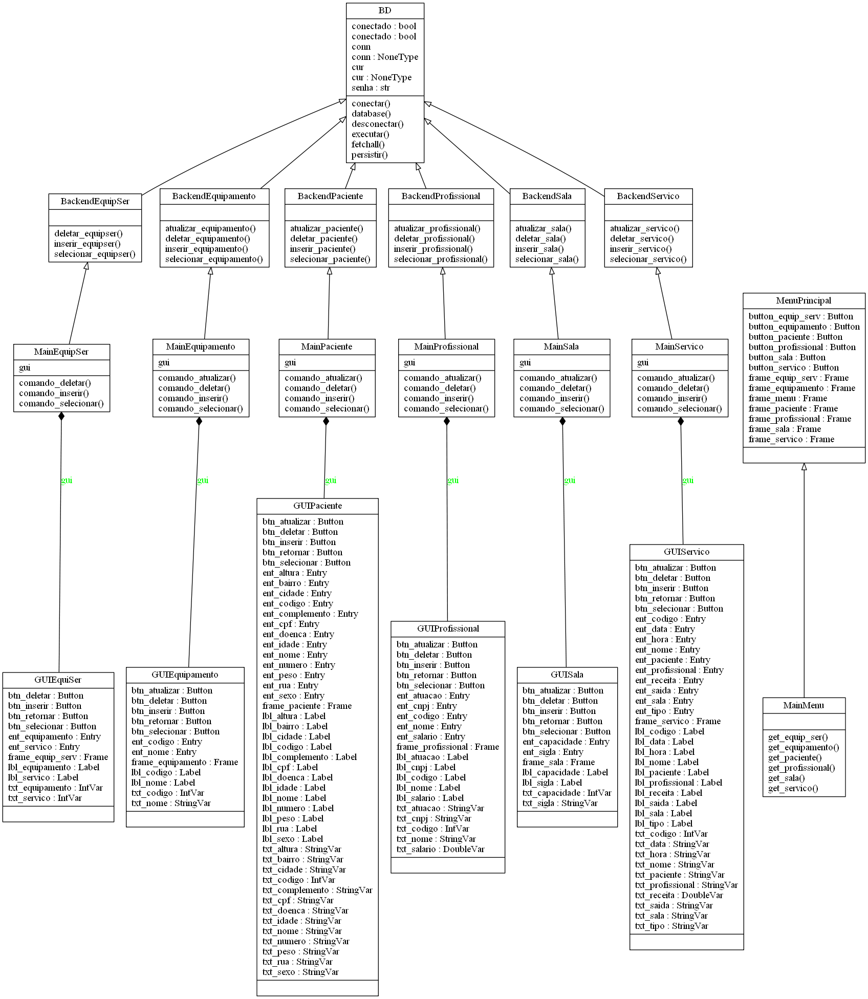

## Diagrama de Classes



### Descrição breve
As classes GUI são responsáveis pela base da interface gráfica. São nelas que estão localizadas as variáveis de Texto, Label, Button, Frame e Entry.
Sem elas tudo se resumiria a uma linha de comando pouco amigável para usuários. 
``` python
class MenuPrincipal
	# Pequeno trecho retirado do código da classe.
	def __init__(self):
        Tk.__init__(self)
        self.frame_menu = tk.Frame(self)
        self.frame_paciente = tk.Frame(self)
        self.frame_profissional = tk.Frame(self)
        self.frame_sala = tk.Frame(self)
        self.frame_equipamento = tk.Frame(self)
        self.frame_servico = tk.Frame(self)
        self.frame_equip_serv = tk.Frame(self)
        self.frame_menu.grid(row=0, column=0)
"""Essa classe é responsável pelo menu que irá abrir todas as outras telas, sendo 
nela que são criados os frames para as outras GUI, junto com o posicionamento 
grid desses frames. Pode-se dizer que ela é o alicerce da interface."""
```

Já as classes Main associam a claúsula "command" do tkinter aos botões e respectivos métodos. Todos, com exceção da `class MainMenu`, herdam das classes Backend,
cada um formando uma linha de conexão para cada tabela do banco. É aqui onde os atributos Text inseridos nos campos das interfaces serão captados usando .get(),
enviando os parâmetros para o backend. Além disso, são realizados testes e inseridas exceções para facilitar o entendimento do usuário.
```python
# Método comando_inserir da class MainPaciente
def comando_inserir(self):
        """Realize o comando INSERT na tabela Paciente."""
        try:
            self.inserir_paciente(self.gui.txt_cpf.get(),
                                  self.gui.txt_nome.get(),
                                  self.gui.txt_idade.get(),
                                  self.gui.txt_sexo.get(),
                                  self.gui.txt_doenca.get(),
                                  self.gui.txt_altura.get(),
                                  self.gui.txt_peso.get(),
                                  self.gui.txt_cidade.get(),
                                  self.gui.txt_bairro.get(),
                                  self.gui.txt_rua.get(),
                                  self.gui.txt_numero.get(),
                                  self.gui.txt_complemento.get())
        except psycopg2.IntegrityError:
            print('CPF já utilizado.')
        except psycopg2.ProgrammingError:
            print('Inseriu letras em campos númericos.')
        except psycopg2.DataError:
            print('Ultrapassou o limite de caracteres ou números de '
                  'um campo.\n'
                  '(OBS: Altura deve ser colocada em metros ex.: 1.75)')
```			
No caso da classe `MainMenu`, ela herdará do `frontend.MenuPrincipal` para facilitar a manipulação dos atributos e botões. Ela se utiliza de métodos 
para invocar cada tela, inserindo como parâmetro para o requisito `parent` a sua própria instância.
```python
class MainMenu(frontend.MenuPrincipal):
    """Atribua comandos aos botões do menu principal"""
    def __init__(self):
        frontend.MenuPrincipal.__init__(self)
        self.button_paciente["command"] = self.get_paciente
        self.button_profissional["command"] = self.get_profissional
        self.button_sala["command"] = self.get_sala
        self.button_equipamento["command"] = self.get_equipamento
        self.button_servico["command"] = self.get_servico
        self.button_servico["command"] = self.get_servico
        self.button_equip_serv["command"] = self.get_equip_ser

    def get_paciente(self):
        """Invoque a GUI Paciente."""
        MainPaciente(self)	 
```		
Por fim, a `class BD` é a responsável por executar o comandos do psycopg2, sendo esses inseridos em métodos para poderem ser utilizados pelas `class Backend`.
Essas classes herdam de `BD` e possuem métodos para captar como parâmetro o que foi enviado pelas classes `Main`.
```python
class BackendPaciente(BD):
    """Realize os comandos SQL da tabela Paciente."""
    def __init__(self):
        BD.__init__(self)

    def inserir_paciente(self, cpf, nome, idade, sexo, doenca, altura, peso,
                         cidade, bairro, rua, numero, complemento):
        """Insira na tabela Paciente as informações."""
        self.conectar()

        if idade == '':
            idade = 'NULL'
        if altura == '':
            altura = 'NULL'
        if peso == '':
            peso = 'NULL'

        self.executar("INSERT INTO paciente(cpf, nome, idade, sexo, doenca, \
                      altura, peso, cidade, bairro, rua, numero, complemento) \
                      VALUES('{}','{}',{},'{}','{}',{},{},'{}', '{}','{}', \
                      '{}','{}')".format(cpf, nome, idade, sexo, doenca,
                                         altura, peso, cidade, bairro, rua,
                                         numero, complemento))

        self.persistir()
        self.desconectar()
```


