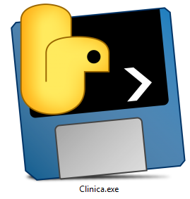

### Pré-Requisitos
* PostgreSQL 

### Download
O executavel do programa pode ser facilmente adquirido no GitHub do projeto, sendo o arquivo a seguir (**clique na imagem para baixar**).

Já o Postgres pode ser baixado neste link (**clique na imagem para ir para o site de downloads**).

