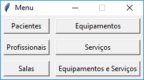
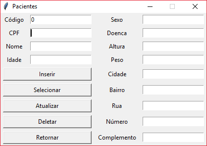
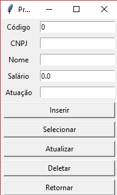
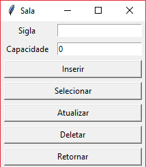
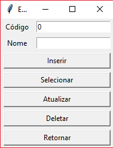
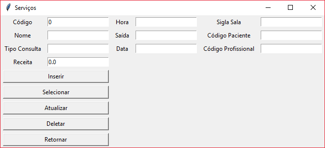
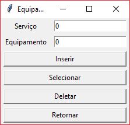

## Prompt de Comando
Ao iniciar o executável, um prompt de comando (cmd) irá aparecer. Ele inicialmente irá tentar-se conectar com o banco de dados
e, caso a senha não seja a padrão ou o computador não possua Postgres, ele irá requisitar que digite a senha certa. Sendo o segundo caso,
feche o CMD e instale o [Postgres](https://www.postgresql.org/download/).

## Telas
O programa possui 7 telas:

### 1. Menu Principal

Cada tabela pode ser acessada com seus respectivos botões nesse menu. É permitido abrir mais de uma tabela ao mesmo tempo e,
quando uma delas for fechada, o menu principal irá se manter. Para sair do programa, basta fechar o menu.

### 2. Tabela Paciente
#### Inserir
Esse botão irá realizar inserir dados no banco com o campos CPF, Nome, Idade, Sexo, Doenca, Altura, Peso,
Cidade, Bairro, Rua, Número e Complemento. É permitido colocar campos vazios, menos no **CPF**.
Suas restrinções são, respectivamente:

1. CPF: coloque um CPF válido com 11 digitos (somente números).
2. Nome: é permitido colocar nomes com até 50 caracteres.
3. Idade: somente números inteiros.
4. Sexo: somente 1 caracterer, digite M para Masculino ou F para Feminino.
5. Doença: é permitido colocar nomes com até 50 caracteres.
6. Altura: coloque a altura em metros, sendo 1 número antes do ponto e duas casas decimais, por exemplo
(1.75).
7. Peso: coloque o peso em  quilogramas, sendo 3 digitos permitidos antes do ponto e uma casa decimal, por exemplo
(69.5).
8. Cidade: é permitido colocar uma cidade com até 30 caracteres.
9. Bairro: é permitido colocar um bairro com até 20 caracteres.
10. Rua: é permitido colocar uma rua com até 50 caracteres.
11. Número: número do local, até 5 digitos.
12. Complemento: apartamento, bloco ou semelhante, 10 caracteres.

#### Selecionar

Ao clicar nesse botão, o sistema irá retornar todas as tuplas com campos semelhantes aos colocados. Aqui pode ser
utilizado o código para buscar. 

#### Atualizar

Esse botão atualiza todos os campos de uma tupla, independente do que você quiser alterar, a partir do código dessa
tupla. **Campos preenchidos serão substituidos por espaços em brancos** caso não repita as informações que quiser manter.

#### Deletar

Elimina uma tupla da tabela a partir do código desejado.

#### Retornar

Esse botão é quase puramente estético, ele fecha a janela da tabela, isso pode ser feito apertando o botão padrão
para fechar.

### 3. Tabela Profissional
#### Inserir 

Insere os seguintes campos:

1. CNPJ: insira um CNPJ válido com 14 digitos.
2. Nome: permitido nomes com 50 caracteres.
3. Salário: válido um número com qualquer quantidade de digitos.
4. Atuação: em que área ou função o profissional atua (25 caracteres).

**Os outros botões tem função semelhante aos da Tabela Paciente.**

### 4. Tabela Sala
#### Inserir

Insere os seguintes dados:

1. Sigla: sigla que irá identificar a sala, 10 caracteres ou digitos.
2. Capacidade: a quantidade de pessoas que a sala suporta, obrigatoriamente um número inteiro.

**Os outros botões tem função semelhante as outras tabelas.**

### 5. Tabela Equipamento
#### Inserir

Insira o nome do equipamento, 30 caracteres. Ele será identificado pelo código gerado pelo sistema.

**Os outros botões tem função semelhante as outras tabelas.**

### 6. Tabela Serviço
#### Inserir

Essa tabela tem características especiais. Os três últimos campos necessariamente devem referenciar tuplas já
existente nas outras tabelas, para garantir a integridade, então é necessario inserir informações nelas.

1. Nome: permitido 30 caracteres.
2. Tipo de Consulta: se é particular, plano (qual plano), 15 caracteres.
3. Receita: coloque o número do valor gerado pelo serviço.
4. Hora: insira a hora que o serviço começou, formato: HH:MM ex. (23:40).
4. Saída: horário que o serviço terminou, formato semelhante.
5. Data: data do serviço, formato: AAAA##MM##DD ex. (2017##05##23).
6. Sigla Sala: insira a sigla da sala onde o serviço aconteceu.
7. Codigo Paciente: insira o código da tupla do paciente atendido.
8. Codigo Profissional: insira o código da tupla do profissional que atendeu.

**Os outros botões tem função semelhante as outras tabelas.**

### 7. Tabela relação Equipamento-Serviço

Essa tabela é somente uma forma de gerar uma conexão entre o equipamento utilizado em determinado serviço.

#### Inserir
1. Serviço: inserir código do serviço.
2. Equipamento: inserir código do equipamento.

